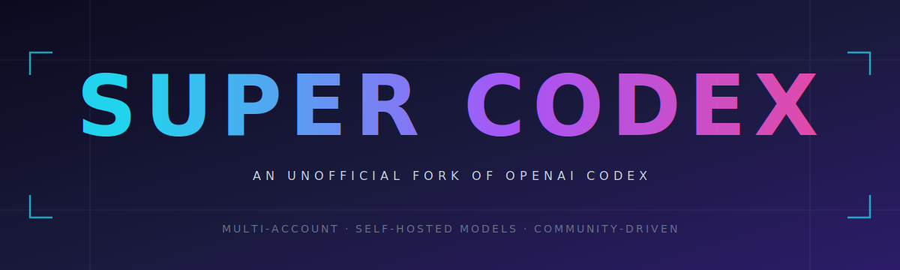

<div align="center">



<br />

[](#disclaimer)
[](https://github.com/openai/codex)
[](LICENSE)
[](https://www.rust-lang.org)

<br />

**Super Codex is an unofficial, community-driven fork of [OpenAI Codex](https://github.com/openai/codex)**
that bends a great coding agent around the way people actually work.

</div>

---

## Vision

Codex is a brilliant coding companion — but it was shaped for a very specific user: one account, one model family, one provider. Super Codex is about **breaking that shape open** without losing what makes Codex good.

The goal is simple: **let the agent fit the developer, not the other way around.**

- People with more than one ChatGPT plan shouldn't have to juggle logins.
- People who run their own hardware shouldn't be locked to a remote API.
- People who hit usage limits mid-task shouldn't lose their flow.

Super Codex is an experiment in making the agent quietly serve the user — from the first prompt to the last token.

---

## What's different

<table>
<tr>
<td width="50%" valign="top">

### Multi-account ChatGPT

Save every ChatGPT account you've got and hop between them in a single slash command. `/accounts` shows the list; pick one with ↑/↓ + Enter to switch live, no restart. When one account hits its usage ceiling, Super Codex will **auto-rotate** to the next saved account mid-turn — no reset, no interruption, no lost context.

</td>
<td width="50%" valign="top">

### Bring your own model

Run Codex against your own self-hosted inference server. **Qwen3-VL-32B-Instruct-AWQ** is wired in out of the box — 4-bit quantised, comfortable on a single 32 GB GPU — and the TUI prompts for the server URL at swap time.

</td>
</tr>
</table>

Everything else — installation, sign-in, slash commands, IDE extensions, the desktop app, configuration, approvals, sandboxes — works exactly as it does in the upstream project.

---

## Everything else

Super Codex is a **fork, not a rewrite.** For installation, quickstart, configuration, the full slash-command reference, the sign-in flow, IDE extensions, the desktop app, and anything else not mentioned above, refer to the upstream project:

<div align="center">

### [→ openai/codex README](https://github.com/openai/codex/blob/main/README.md)

### [→ Codex Documentation](https://developers.openai.com/codex)

</div>

The only additions in this fork are the ones listed under [What's different](#whats-different). Treat the upstream docs as the source of truth for everything else.

---

## Install

```bash
npm install -g @beltromatti/supercodex
supercodex --help
```

The npm package is a thin launcher; its postinstall downloads the right binary for your platform (macOS arm64, Linux x64, Windows x64) from the matching [GitHub Release](https://github.com/beltromatti/supercodex/releases). No `@openai/...` platform sub-packages involved.

---

## Contributing & deeper docs

Super Codex is a small, opinionated fork. Before opening an issue or a pull request, please skim:

- [**Contributing guide**](docs/contributing.md) — scope, where issues belong vs. upstream, merge-window cadence, PR checklist.
- [**Technical notes**](SUPERCODEX.md) — complete description of every change relative to upstream, the release pipeline, the postinstall mechanism, and the maintenance workflow.

---

## Disclaimer

> [!WARNING]
> **Super Codex is not affiliated with, endorsed by, or supported by OpenAI.**
> It is a personal fork maintained by an independent developer.
>
> The software is provided **"as is", without warranty of any kind**, express or implied. The author is **not responsible** for:
> - how you use this software, including any interaction with OpenAI's services or terms of use;
> - any data loss, account action, billing impact, or damage caused by running it;
> - any discrepancy between its behaviour and the official OpenAI Codex;
> - anything produced, suggested, or executed by the agent while it is running.
>
> If you need official support, a supported product, or a stable release cadence, use the [official OpenAI Codex](https://github.com/openai/codex) instead. If you have any doubt about whether a given feature complies with OpenAI's terms of service for your plan, review those terms yourself before enabling it.

---

## License

Super Codex inherits the upstream license — **[Apache-2.0](LICENSE)**, the same license as OpenAI Codex.

<br />

<div align="center">

<sub>Built on top of <a href="https://github.com/openai/codex">OpenAI Codex</a>  ·  Not an OpenAI product  ·  Use at your own discretion</sub>

</div>
